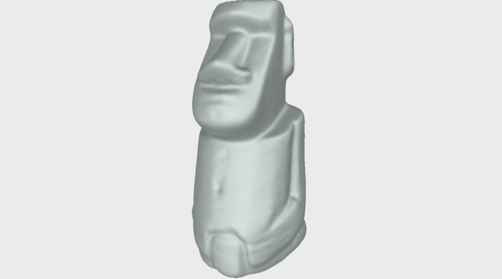
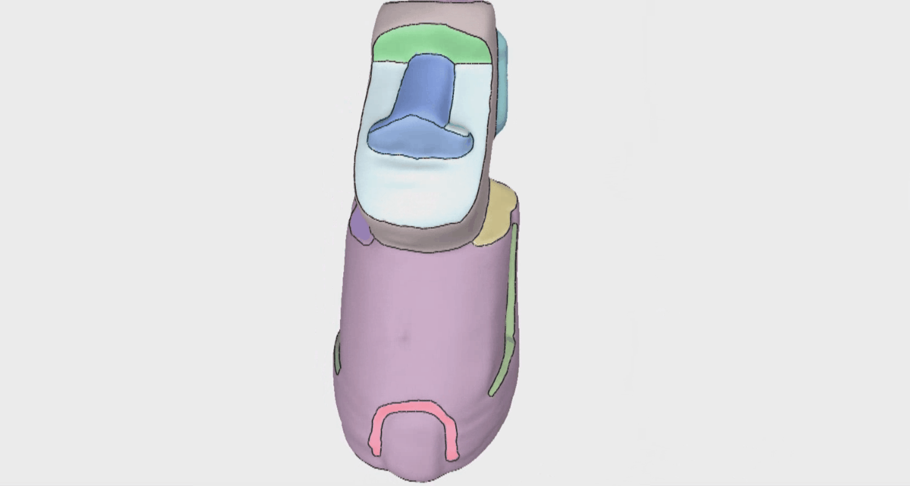

# Mesh Segmentation

This repository contains the source codes for the paper [Feature-Aligned Segmentation using Correlation Clustering](http://yixina.net/projects/FeatureSeg/FeatureSeg_CVM17.pdf). The tool provides an interactable way of segmenting a mesh into patches whose boundaries are aligned with prominent ridge and valley lines of the shape.

    

### Citing this work

If you find this work useful in your research, please consider citing:
```
@article {FeatureSeg17,
title = {Feature-Aligned Segmentation using Correlation Clustering},
author = {Yixin Zhuang, Hang Dou, Nathan Carr, and Tao Ju}
journal = {Computational Visual Media, (Computational Visual Media Conference2017)},
year = {2017},
volume = {3},
number = {2},
pages = {147-160}
}
```

### Project Page

The project page is available at http://yixina.net/projects/FeatureSeg/.


## Compile

### Clone the repo and install dependencies

This implementation uses [Qt5.12.2 vs2015_x64] [Visual C++ 2015 x64] [boost_1_67_0 ]
Other dependencies can be found on the folder ./libs/.

We use the source code of [Trimesh](http://graphics.stanford.edu/software/trimesh/) and [Crestline](http://www2.riken.jp/brict/Yoshizawa/Research/Crest.html) in our project.


## Run Executable Demo
 
After reading a mesh, segmentation is automatically perfomred.


## Interaction
 
 
 
 
 

## License

[MIT](https://github.com/ThibaultGROUEIX/AtlasNet/blob/master/license_MIT)